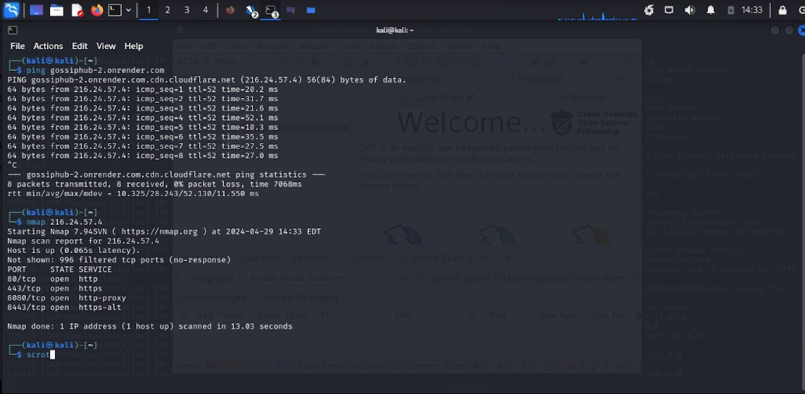

# GossipHub
El objetivo del proyecto es crear una aplicación web que integra tanto el desarrollo backend como el frontend, cumpliendo con rigurosos estándares de seguridad y funcionalidad. Este proyecto se enfoca en la creación de un sistema donde los usuarios pueden completar un formulario de inicio de sesión y el usuario con role admin, tiene la capacidad de gestionar estos usuarios. A continuación, se detallan los principales aspectos y requisitos del proyecto:

## Funciones principales.

### Login:
- Validación exhaustiva de los campos del formulario en el lado del cliente y del servidor, asegurando que se cumplan los criterios de formato, longitud y tipo de datos.
- Protección contra ataques de XSS y SQL Injection mediante la aplicación de filtros y escapes de caracteres especiales en los datos ingresados por el usuario.
- Uso de ReCaptcha de Google para prevenir el envío automatizado de formularios por bots.
- Inclusión de campos ocultos en el formulario para evitar envíos no deseados y garantizar la integridad de los datos.

### Gestión de Usuarios:
- Implementación de un sistema de autenticación basado en roles, con dos tipos de usuarios: Administrador (Admin) y Usuario (User).
- Creación de una ruta de administrador que requiere autenticación para acceder al panel de control, donde el administrador puede realizar operaciones CRUD (Crear, Leer, Actualizar, Eliminar) sobre los registros de usuarios en la base de datos.
- Aplicación de JWT (JSON Web Tokens) para la autenticación de usuarios, garantizando la seguridad de las transacciones y la gestión de sesiones.

### Seguridad y Protección de Datos:
- Utilización de middleware para proteger las rutas contra posibles ataques de fuerza bruta, limitando el número de peticiones aceptadas por IP.
- Validación rigurosa de los datos de usuario, incluyendo la aplicación de hashing en las contraseñas para garantizar su cifrado seguro.
- Validación y sanitización de los datos ingresados por el usuario para prevenir vulnerabilidades de XSS y bot attacks.

## Instalación:

#### Lo primero que debemos hacer es clonar el repositorio:
```bash
    git clone 'https://github.com/FiorellaSF/GossipHub.git'
```

### Back-end:
1. Acceder a la carpeta 'backend'
```bash
    cd backend
```
2. Iniciar la aplicación
```bash
    nodemon
```

### Fron-end: 
1. Acceder a la carpeta 'front'
```bash
    cd front
```
2. Iniciar la aplicación
```bash
    npm start
```

## Tecnologías Utilizadas:

### Back-end:
- **Express.js**: Framework de Node.js para construir aplicaciones web y APIs.
- **MongoDB**: Base de datos NoSQL utilizada para almacenar los datos del proyecto.
- **Mongoose**: Librería de modelado de objetos MongoDB para Node.js, que proporciona una solución simple basada en esquemas para modelar los datos de la aplicación.
- **bcryptjs**: Librería para cifrar contraseñas.
- **CORS**: Middleware para Express.js que habilita el control de acceso HTTP.
- **dotenv**: Módulo que carga variables de entorno desde un archivo .env en el proceso process.env.
- **jsonwebtoken**: Implementación de JSON Web Tokens (JWT) para autenticación basada en tokens.
- **express-rate-limit**: Middleware para Express.js que limita el número de solicitudes recibidas por un usuario en un período de tiempo determinado.

### Front-end: 
- **React**: Biblioteca de JavaScript para construir interfaces de usuario.
- **React DOM**: Paquete que proporciona métodos específicos para manipular el DOM en aplicaciones React.
- **React Router DOM**: Enrutador para React que permite la navegación declarativa y basada en componentes.
- **Axios**: Cliente HTTP basado en promesas para el navegador y Node.js.
- **jwt-decode**: Librería para decodificar tokens JWT en el navegador.
- **dompurify**: Biblioteca para limpiar HTML utilizando un enfoque seguro para evitar ataques XSS.
- **xss**: Módulo para evitar ataques XSS en aplicaciones web.

## Autoría 

## Análisis de Seguridad del Servidor

### Ping y Escaneo de Puertos




El primer comando ejecutado fue `ping gossiphub-2.onrender.com`, que muestra la respuesta del servidor de nombres DNS al intentar hacer ping al dominio "gossiphub-2.onrender.com". La dirección IP resuelta para este dominio es 216.24.57.4, y el tiempo de ida y vuelta (RTT) para los paquetes ICMP es en su mayoría bastante bajo, oscilando entre 10.3 ms y 52.1 ms.

El segundo comando fue `nmap 216.24.57.4`, que realiza un escaneo de puertos en la dirección IP 216.24.57.4. El escaneo revela que los puertos TCP 80 (HTTP), 443 (HTTPS), 8080 (HTTP proxy) y 8443 (HTTPS alternativo) están abiertos en el servidor.

### Registro de Actividad del Servidor Web


En esta imagen podemos ver un registro de actividad de servidor web durante un análisis de seguridad. El registro muestra intentos de acceso a archivos sensibles, solicitudes POST con parámetros potencialmente maliciosos y redirecciones. Se observa una combinación de códigos de estado HTTP, incluidos 404 (Not Found), 301 (Moved Permanently) y 200 (OK), junto con detalles de las solicitudes y respuestas.

## Análisis de Ejecución de SQLMap


El análisis revela lo siguiente:

- **Inicio de la ejecución:** El comando comenzó a las 15:44:30 el 29 de abril de 2024.
- **Pruebas de conexión:** Se realizó una prueba para verificar la conexión con la URL de destino.
- **Detección de WAF/IPS:** Se realizó una verificación para determinar si el objetivo está protegido por algún tipo de WAF (Firewall de Aplicaciones Web) o IPS (Sistema de Prevención de Intrusiones).
- **Estabilidad del contenido:** Se verificó la estabilidad del contenido de la URL de destino.
- **Inyección de SQL:** Se iniciaron pruebas exhaustivas de inyección de SQL en el parámetro 'User-Agent' con un nivel de riesgo de 3 y un nivel de profundidad de 5.
- **Resultados:** Se detectó que el parámetro 'User-Agent' no parece ser dinámico y no es inyectable. Además, se identificó un WAF/IPS como 'CloudFlare' que puede estar interfiriendo con las pruebas de inyección de SQL.

El comando `sqlmap` está diseñado para ayudar en la identificación y explotación de vulnerabilidades de inyección de SQL en aplicaciones web. Sin embargo, es importante tener en cuenta que el uso de esta herramienta para atacar objetivos sin consentimiento mutuo previo es ilegal y puede resultar en consecuencias legales. Los usuarios deben cumplir con todas las leyes y regulaciones aplicables al utilizar `sqlmap`.

